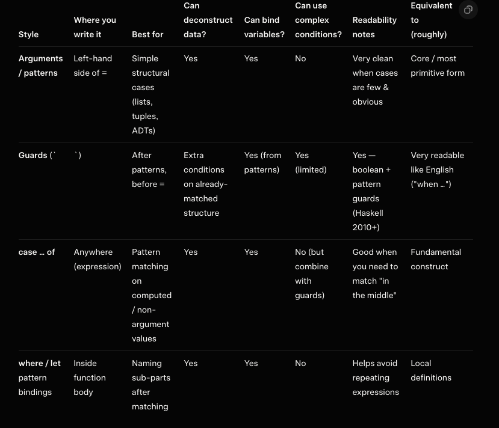

# Haskell

Trying out Haskell.


"you do computations in Haskell by declaring what something is instead of declaring how you get it"

## Install 

We use [`GHCup`](https://www.haskell.org/ghcup/) to install the compiler.

```Bash
brew install ghcup # on Mac
curl --proto '=https' --tlsv1.2 -sSf https://get-ghcup.haskell.org | sh # otherwise
```

Then run `GHCup tui` and select a compiler to insall. We use the recommended `GHC` one.

Add `.ghcup` bin to `PATH`
```bash
export PATH="$HOME/.ghcup/bin:$PATH"
```

## Doc 

- [Lean you a Haskell](https://learnyouahaskell.github.io/introduction.html#so-whats-haskell)

## Intercative 
```bash
ghci # open interactive window
:l [module_name] # import function from files
:q # quit
:r # reload module
:t # get the type of an expression 
```

## Types

- `Int`: 64 bits
- `Integer`: not bounded, less efficient
- `Float`: single precision floating point
- `Double`: double precision
- `Bool`
- `Char`
- `String`
- `a`: generic type

## Typeclass

Eqauivalent to trait bound in Rust

- `Eq`: define == and /=
- `Ord`: define <, >, >=, <= and `compare` (which return an Ordering type i.e. GT,LT,EQ)
- `Show`: types that can be presented as strings (e.g. show 3)
- `Read`: The read function takes a string and returns a type which is a member of Read. Can force the type e.g. read "5" :: Int 
- `Enum`: types that can be enumerated on which we can use `succ` and `pred`. Types in this class: (), Bool, Char, Ordering, Int, Integer, Float and Double
- `Bounded`:  members have an upper and a lower bound. e.g. minBound :: Int
- `Num`: numeric typeclass, able to act like numbers.
- `Integral`: like `Num` for integral numbers
- `Floating`: Float and Double 

We can use `fromIntegral` function to convert a Integral type to a Num type ( e.g. fromIntegral (length [1,2,3,4]) + 3.2)

# Pattern matching

